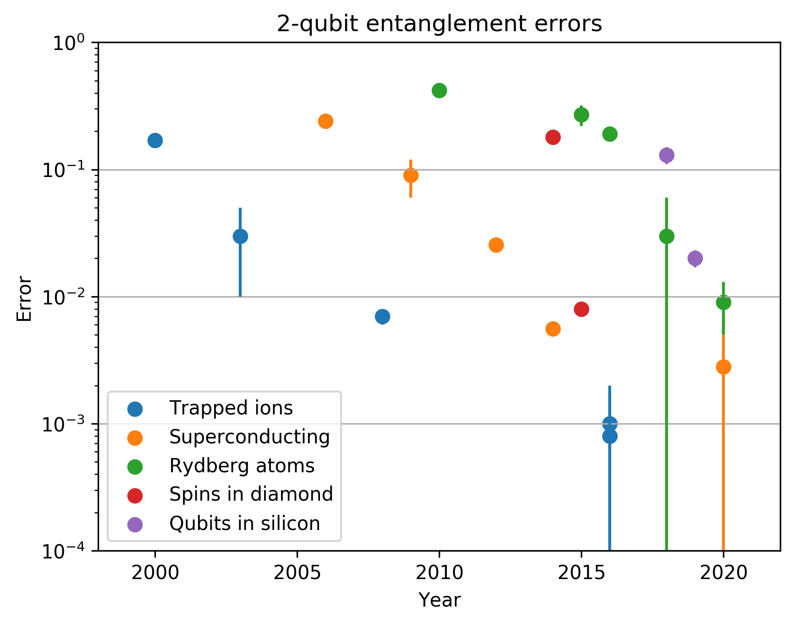
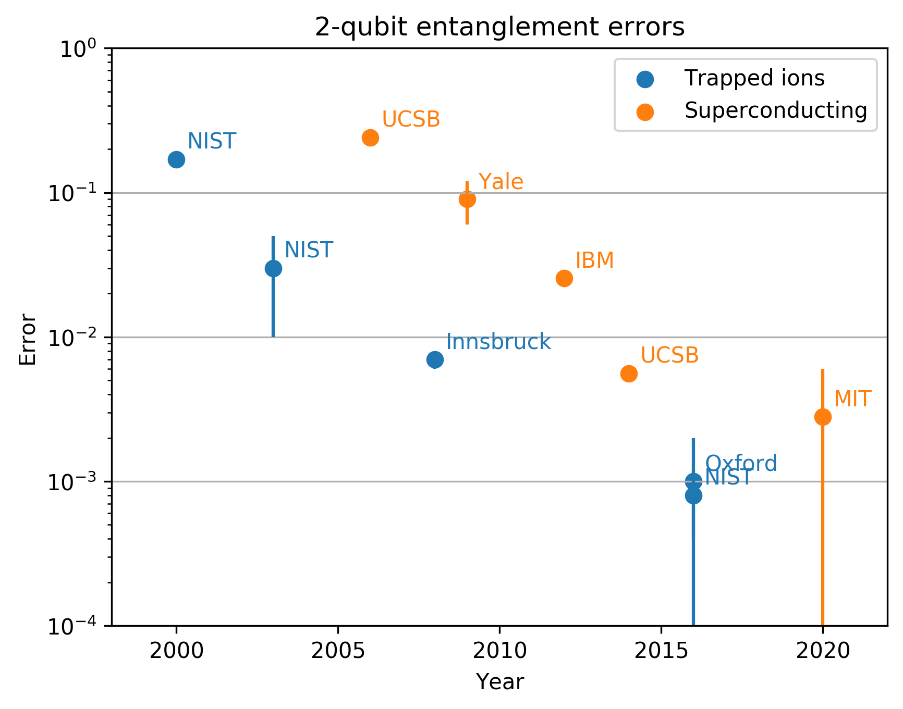
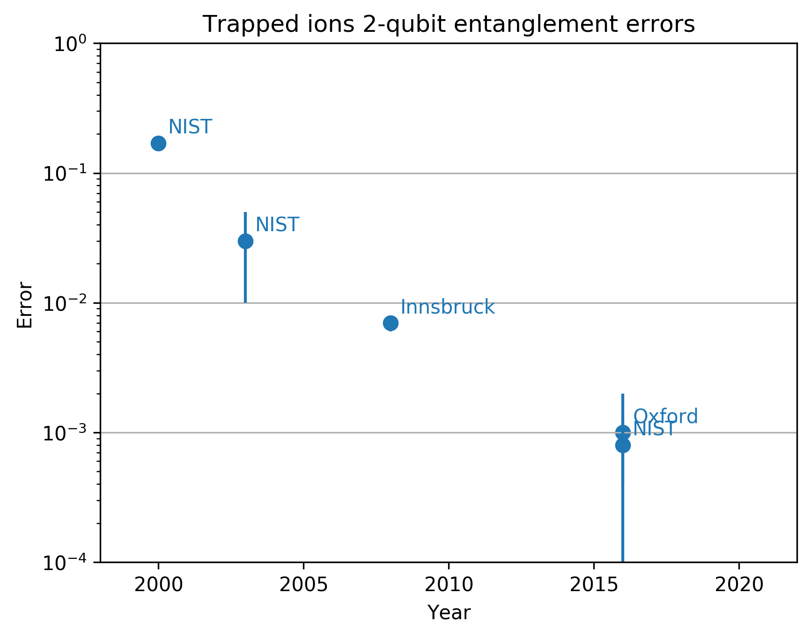
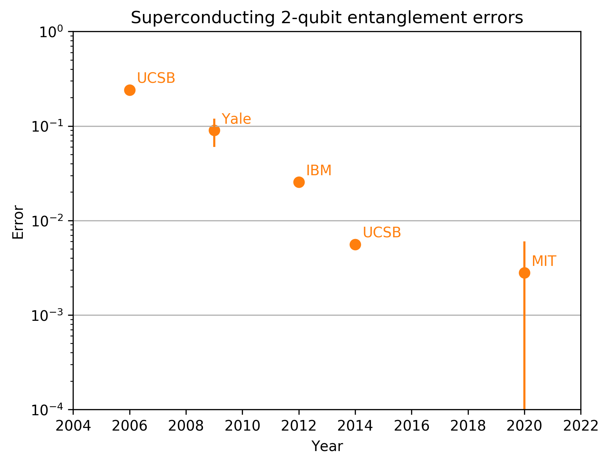
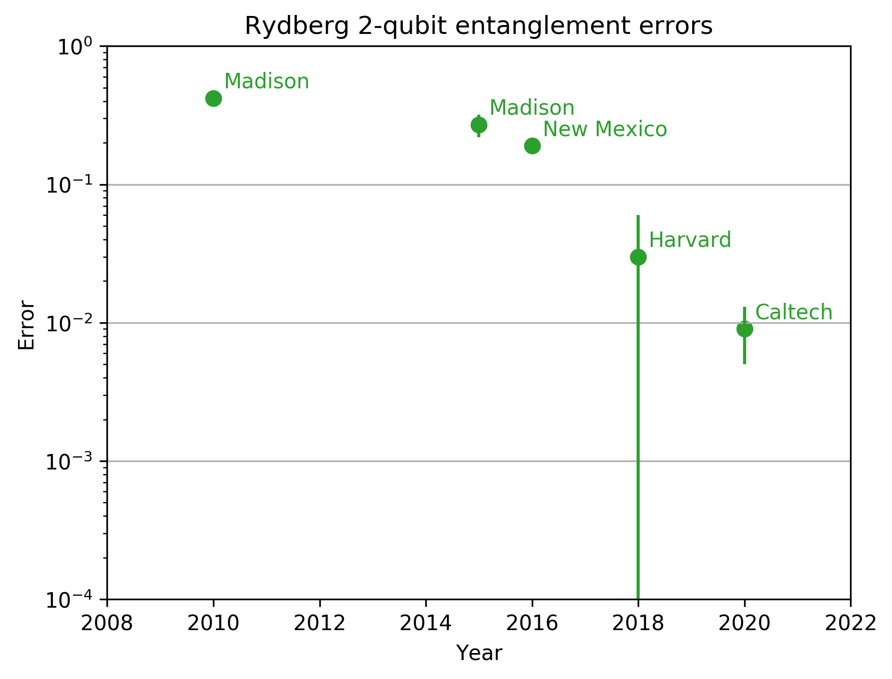
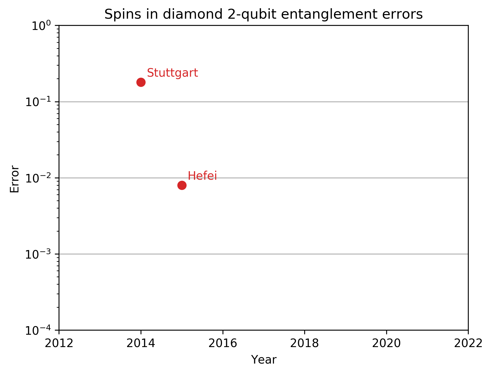
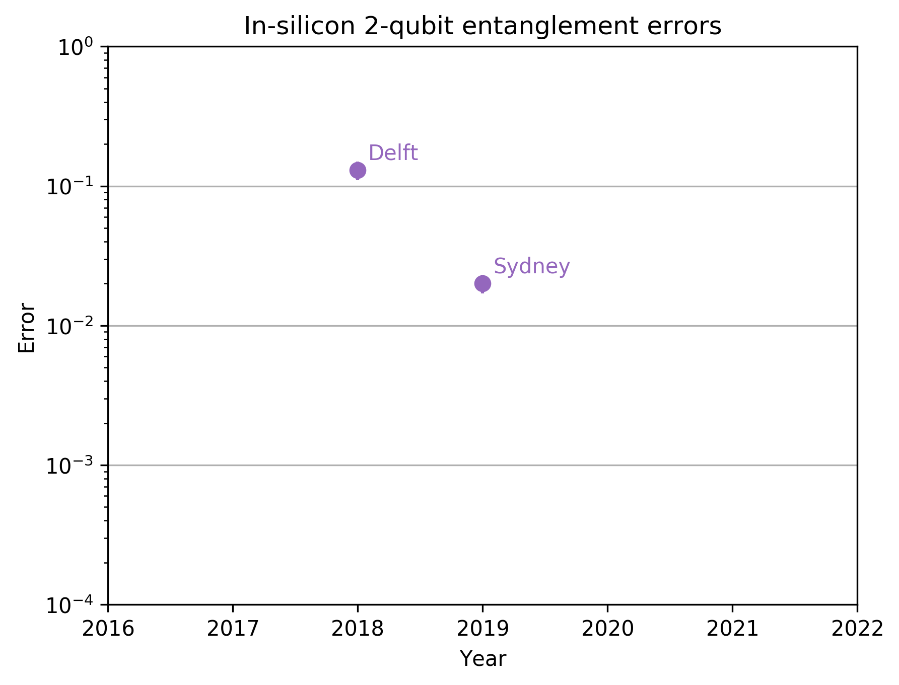

# Quantum computing benchmark database
## Project aim
This page aim to collect and present up-to-date information about important qubit metrics across promising quantum computing platforms. I want to keep track of a few informative benchmarks, display them as nice plots, and provide the raw data for anyone to use.
## Contributing
It is very important to me for the information presented here to be
- Up-to-date
- Useful and clear
- Error-free
- Uncontroversial

I welcome contributions from everybody, which are particularly essential for the database to stay up-to-date. If you spot an error (or a controversial statement), or would like to propose a way the database could be more useful and clear (including new benchmarks), please raise an issue on github or email me at maciejm@phys.ethz.ch.

# 2-qubit gate fidelities
This is th first benchmark on this site (hopefully many more to come!). All the plots are available as png and pdf files in the repo. You can also find raw data and plotting scripts there.

## Cross-platform comparisons
The best measured entanglement fidelities across different platforms:

Comparison of trapped ion and superconducting qubit performance

## Individual platforms

All platforms individually, annotated with the place where the result was obtained, and the data source table (copied from CSV files in the repo)

### Trapped ions

| Year | Error  | Uncertainty | Place     | Method | Citation       | 
|------|--------|-------------|-----------|--------|----------------| 
| 2000 | 0.17   | 0.01        | NIST      | Bell   | Sackett2000    | 
| 2003 | 0.03   | 0.02        | NIST      | Bell   | Leibfried2003b | 
| 2008 | 0.007  | 0.001       | Innsbruck | Bell   | Benhelm2008    | 
| 2016 | 0.0008 | 0.0004      | NIST      | Bell   | Gaebler2016    | 
| 2016 | 0.001  | 0.001       | Oxford    | Bell   | Ballance2016   |

### Superconducintg qubits

| Year | Error  | Uncertainty | Place | Method       | Citation       | 
|------|--------|-------------|-------|--------------|----------------| 
| 2006 | 0.24   | 0.01        | UCSB  | Tomography   | Steffen2006    | 
| 2009 | 0.09   | 0.03        | Yale  | Tomography   | Dicarlo2009    | 
| 2012 | 0.0255 | 0.0001      | IBM   | Tomography   | Chow2012       | 
| 2014 | 0.0056 | 0.0005      | UCSB  | Benchmarking | Barends2014    | 
| 2020 | 0.0028 | 0.0032      | MIT   | Benchmarking | Kraergaard2020 | 

### Rydberg atoms

| Year | Error | Uncertainty | Place      | Method | Citation     | 
|------|-------|-------------|------------|--------|--------------| 
| 2010 | 0.42  | 0.04        | Madison    | Bell   | Zhang2010    | 
| 2015 | 0.27  | 0.05        | Madison    | Bell   | Maller2015   | 
| 2016 | 0.19  | 0.02        | New Mexico | Bell   | Jau2016      | 
| 2018 | 0.03  | 0.03        | Harvard    | Bell   | Levine2018   | 
| 2020 | 0.009 | 0.004       | Caltech    | Bell   | Madjarov2020 | 

### Spins in diamond

| Year | Error | Uncertainty | Place     | Method         | Citation  | 
|------|-------|-------------|-----------|----------------|-----------| 
| 2014 | 0.18  | 0.01        | Stuttgart | Tomography     | Dolde2014 | 
| 2015 | 0.008 | 0.0001      | Hefei     | Multiple gates | Rong2015  | 

### Qubits in silicon

| Year | Error | Uncertainty | Place  | Method       | Citation | 
|------|-------|-------------|--------|--------------|----------| 
| 2018 | 0.13  | 0.02        | Delft  | Tomography   | Watson18 | 
| 2019 | 0.02  | 0.003       | Sydney | Benchmarking | Huang19  | 

