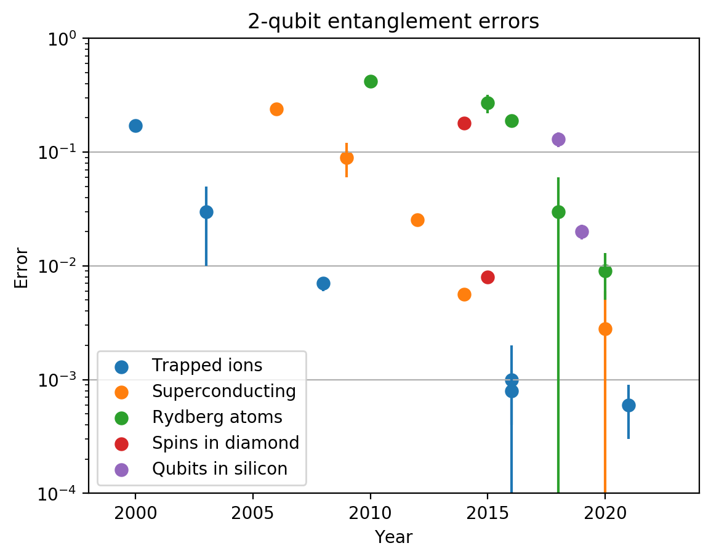
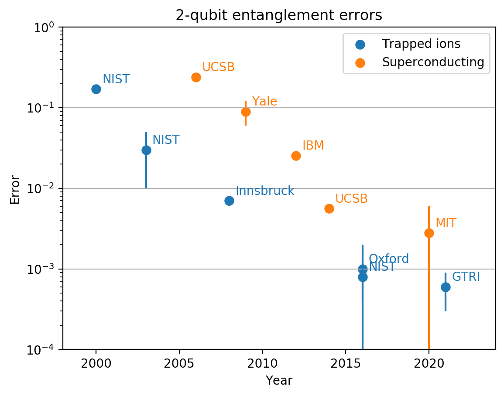
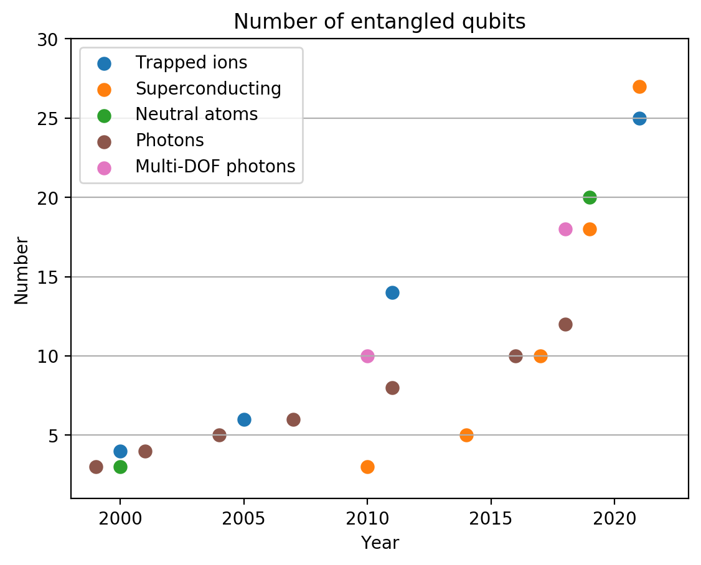

# Quantum computing benchmark database
## Project aim
This page aim to collect and present up-to-date information about important qubit metrics across promising quantum computing platforms. I want to keep track of a few informative benchmarks, display them as nice plots, and provide the raw data for anyone to use.
## Contributing
It is very important to me for the information presented here to be
- Up-to-date
- Useful and clear
- Error-free
- Uncontroversial

I welcome contributions from everybody, which are particularly essential for the database to stay up-to-date. If you spot an error (or a controversial statement), or would like to propose a way the database could be more useful and clear (including new benchmarks), please raise an issue on github.

## 2-qubit entanglement fidelities
Main page: [entanglement fidelities](entanglement_fidelities/summary.md).

Examples:

## Number of genuinely entangled qubits

Main page: [entanglement size](entanglement_size/summary.md).

Examples:

