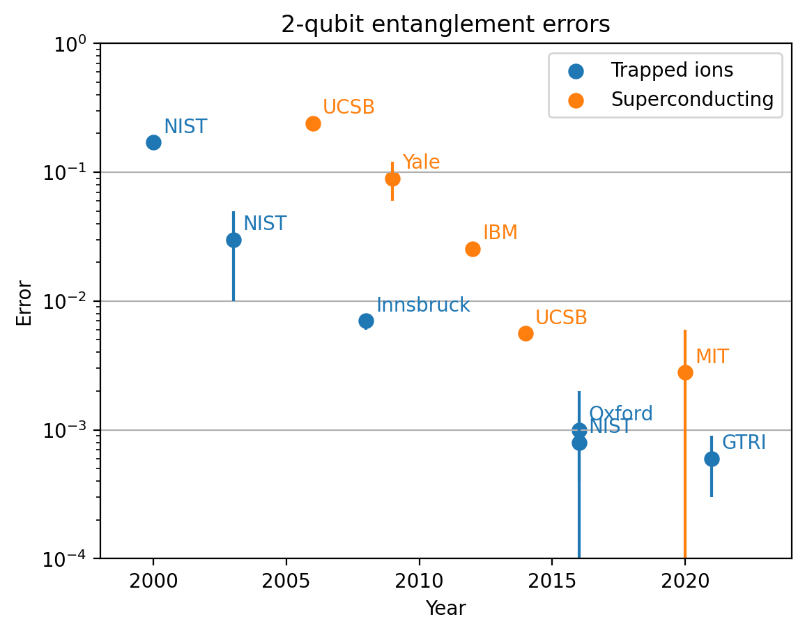
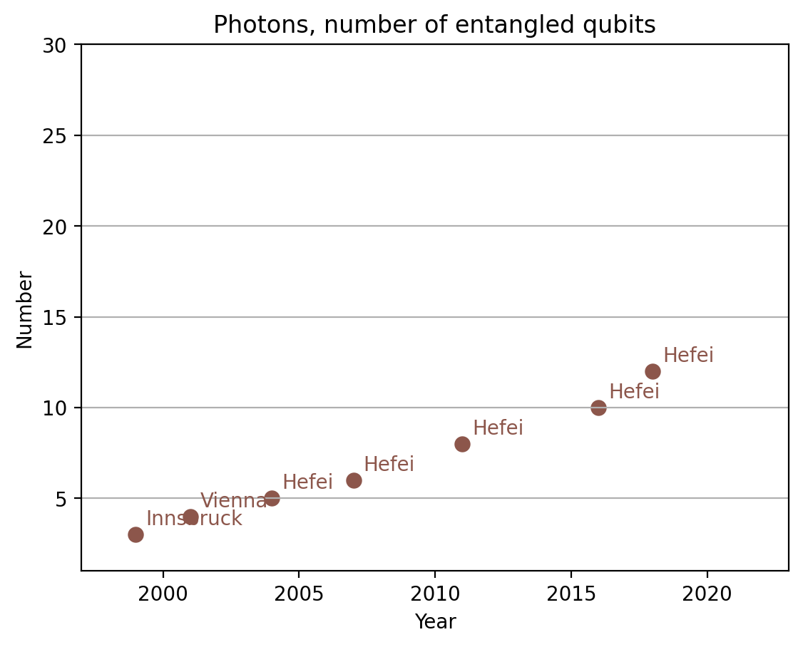

# Quantum computing benchmark database
## Project aim
This page aim to collect and present up-to-date information about important qubit metrics across promising quantum computing platforms. I want to keep track of a few informative benchmarks, display them as nice plots, and provide the raw data for anyone to use.
## Contributing
It is very important to me for the information presented here to be
- Up-to-date
- Useful and clear
- Error-free
- Uncontroversial

I welcome contributions from everybody, which are particularly essential for the database to stay up-to-date. If you spot an error (or a controversial statement), or would like to propose a way the database could be more useful and clear (including new benchmarks), please raise an issue on github

## Setup
Pre-requisites:

* Python ^3.8
* [Poetry ^1.1](https://python-poetry.org/)
    * `curl -sSL https://install.python-poetry.org | python3 -`
    * Or see instructions for Windows
      [here](https://python-poetry.org/docs/#windows-powershell-install-instructions)
* [Poe the poet task runner](https://github.com/nat-n/poethepoet)
    * `pip3 install poethepoet`

To install dependencies and create virtual env: `poetry install`.

## Repository structure
- `quantum_benchmarks/entanglement_fidelities` contains the data, plots and code about two-qubit entangled state fidelities
- `quantum_benchmarks_entanglement_sizes` contains the data, plots and code about multi-qubit entangled state sizes

## Using the repository

- `poe plot-all` generates all the plots, and displays some of them
- `poe plot-fidelities` generates plots of entanglement fidelities
- `poe plot-size` generates plots of entanglement sizes

# Outputs

## 2-qubit entanglement fidelities
Main page: [entanglement fidelities](quantum_benchmarks/entanglement_fidelities/summary.md).

Examples:

## Number of genuinely entangled qubits

Main page: [entanglement size](quantum_benchmarks/entanglement_size/summary.md).

Examples:

