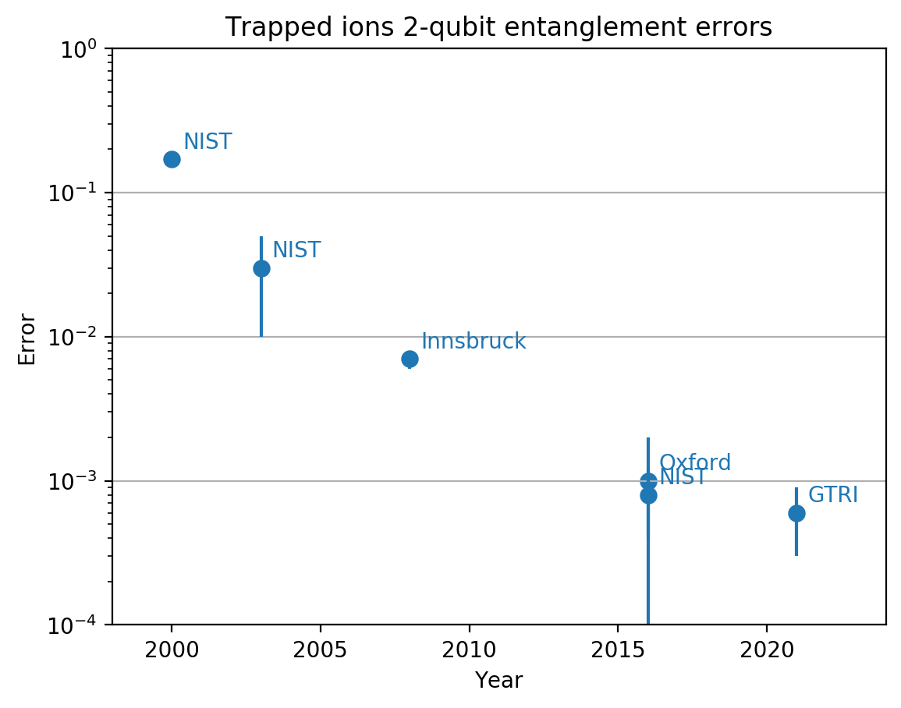
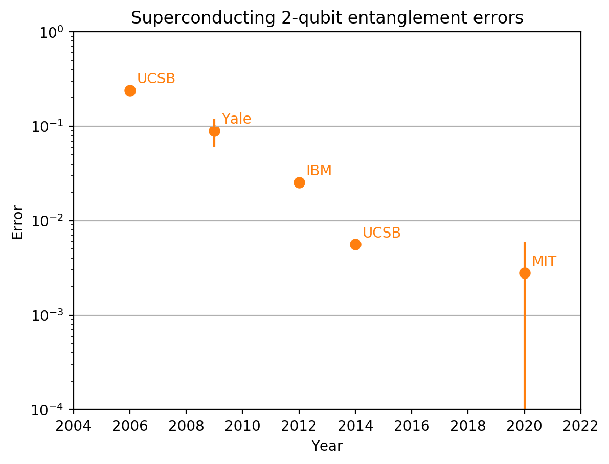
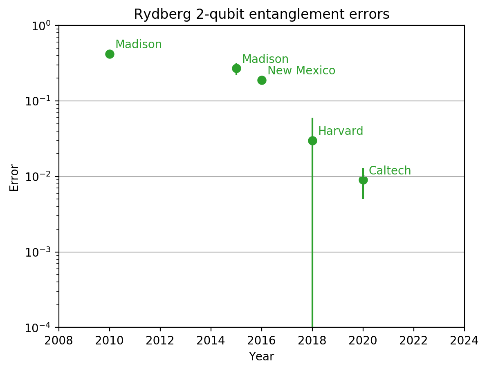
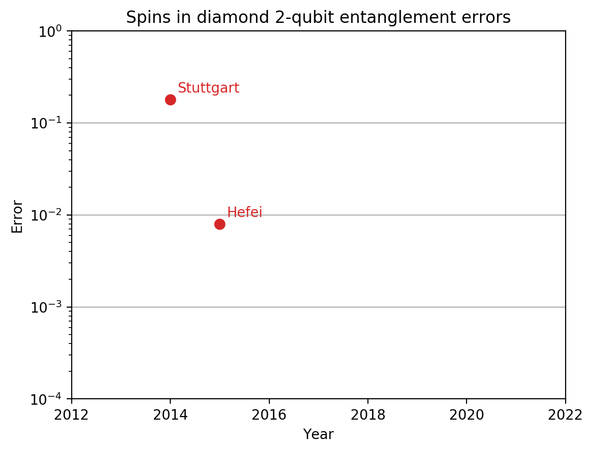
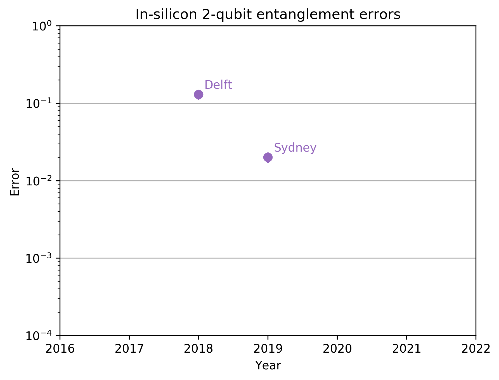

# 2-qubit gate fidelities

## Cross-platform comparisons
The best measured entanglement fidelities across different platforms:

Comparison of trapped ion and superconducting qubit performance

## Individual platforms

All platforms individually, annotated with the place where the result was obtained, and the data source table (copied from CSV files in the repo)

### Trapped ions

| Year | Error  | Uncertainty | Place     | Method | Citation       | 
|------|--------|-------------|-----------|--------|----------------| 
| 2000 | 0.17   | 0.01        | NIST      | Bell   | Sackett2000    | 
| 2003 | 0.03   | 0.02        | NIST      | Bell   | Leibfried2003b | 
| 2008 | 0.007  | 0.001       | Innsbruck | Bell   | Benhelm2008    | 
| 2016 | 0.0008 | 0.0004      | NIST      | Bell   | Gaebler2016    | 
| 2016 | 0.001  | 0.001       | Oxford    | Bell   | Ballance2016   |

### Superconducintg qubits

| Year | Error  | Uncertainty | Place | Method       | Citation       | 
|------|--------|-------------|-------|--------------|----------------| 
| 2006 | 0.24   | 0.01        | UCSB  | Tomography   | Steffen2006    | 
| 2009 | 0.09   | 0.03        | Yale  | Tomography   | Dicarlo2009    | 
| 2012 | 0.0255 | 0.0001      | IBM   | Tomography   | Chow2012       | 
| 2014 | 0.0056 | 0.0005      | UCSB  | Benchmarking | Barends2014    | 
| 2020 | 0.0028 | 0.0032      | MIT   | Benchmarking | Kraergaard2020 | 

### Rydberg atoms

| Year | Error | Uncertainty | Place      | Method | Citation     | 
|------|-------|-------------|------------|--------|--------------| 
| 2010 | 0.42  | 0.04        | Madison    | Bell   | Zhang2010    | 
| 2015 | 0.27  | 0.05        | Madison    | Bell   | Maller2015   | 
| 2016 | 0.19  | 0.02        | New Mexico | Bell   | Jau2016      | 
| 2018 | 0.03  | 0.03        | Harvard    | Bell   | Levine2018   | 
| 2020 | 0.009 | 0.004       | Caltech    | Bell   | Madjarov2020 | 

### Spins in diamond

| Year | Error | Uncertainty | Place     | Method         | Citation  | 
|------|-------|-------------|-----------|----------------|-----------| 
| 2014 | 0.18  | 0.01        | Stuttgart | Tomography     | Dolde2014 | 
| 2015 | 0.008 | 0.0001      | Hefei     | Multiple gates | Rong2015  | 

### Qubits in silicon

| Year | Error | Uncertainty | Place  | Method       | Citation | 
|------|-------|-------------|--------|--------------|----------| 
| 2018 | 0.13  | 0.02        | Delft  | Tomography   | Watson18 | 
| 2019 | 0.02  | 0.003       | Sydney | Benchmarking | Huang19  | 

## FAQ
### Which data points are shown in these plots?

The plots show the lowest measured entanglement errors for different platforms. A result is included if its *average* infidelity is below the previous average infidelity.

### What is an entanglement error?

The plotted error = 1 - fidelity, where the fidelity refers to a process fidelity of a maximally entangling gate (e.g. C-NOT, C-Z), or the state fidelity of a maximally entangled state. Note: some of the older papers use the Nielsen&Chuang definiton of "fidelity", which we now typically call the "square root fidelity". 

### What does the "Method" column mean?
**Tomography**: Fidelity was estimated through either quantum process tomography, or quantum state tomography over multiple input states. For example, some papers use state tomography to estimate the fidelity of producing different Bell states. In such case, the average infidelity is plotted.

**Benchmarking**: Fidelity estimated from [randomised benchmarking](https://qiskit.org/textbook/ch-quantum-hardware/randomized-benchmarking.html). This error corresponds to be estimated error per 2-qubit gate, which will be lower than the average clifford error.

**Bell**: State fidelity was measured only for a single Bell state. 

**Multiple gates**: The gate was applied multiple times in a sequence to amplify and estimate the error.

## Technical support
- The plots shown below are generated by the [plotting.py](plotting.py) file. Feel free to take it and adapt to your own purposes.
- Raw data files are stored in CSV format in the data folder, divided by platform. The tables below are copy-pasted by hand.
- Citation keys in the tables correspond to bibtex entries. The bibtex files are also available in the data folder, divided by platform
- Bibtex files contain annotations, explaining how the fidelity was extracted from the paper, if unclear
- All the plots are available in the plots folder in PNG and PDF

