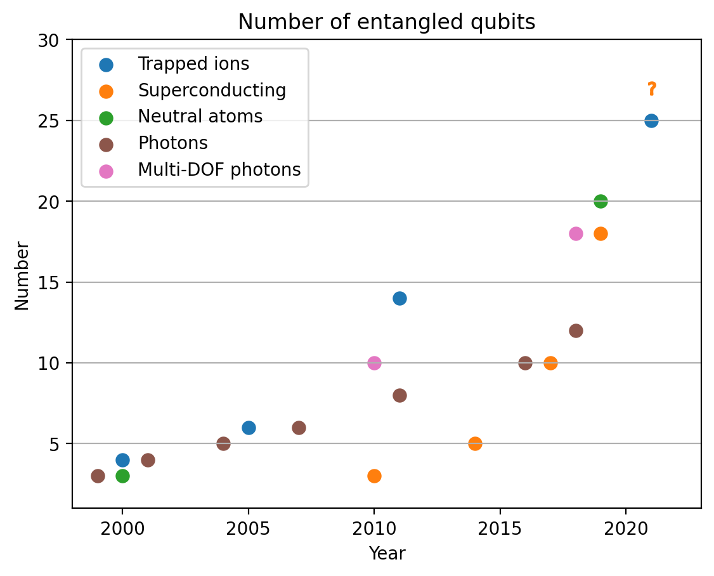
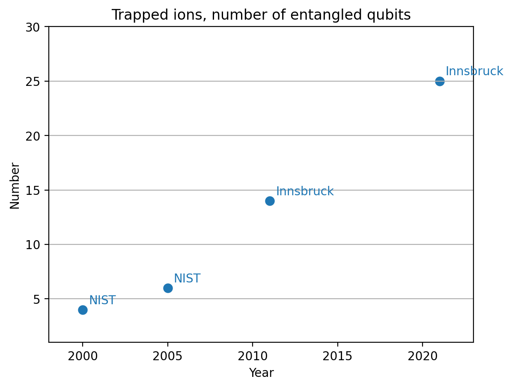
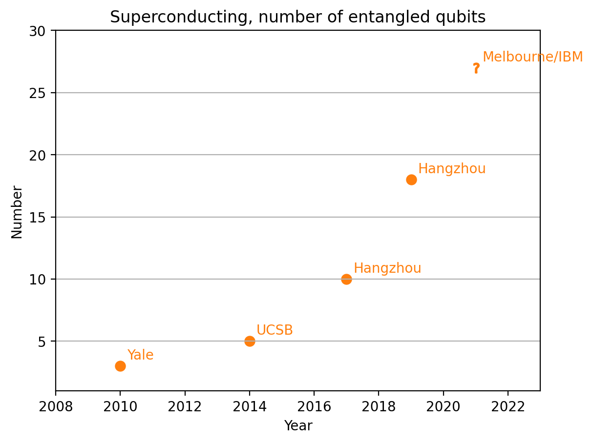
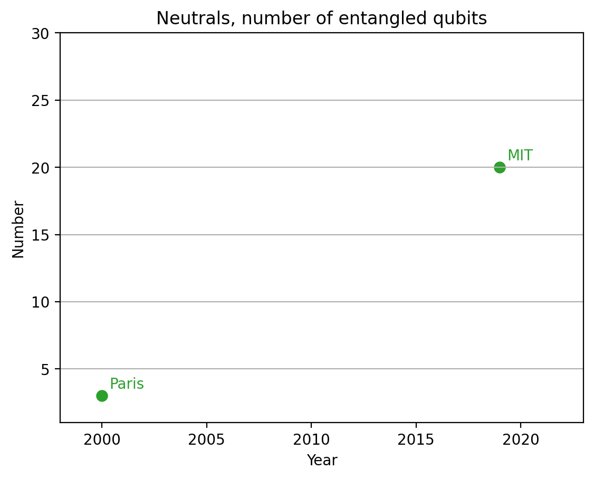
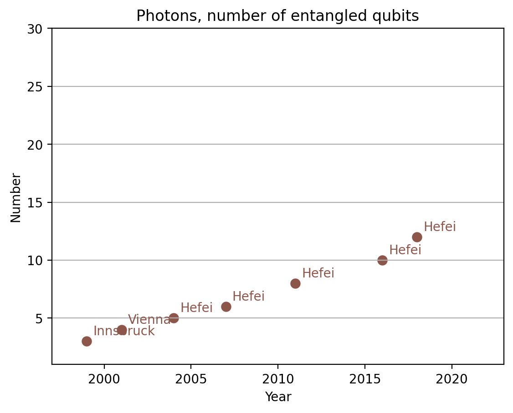
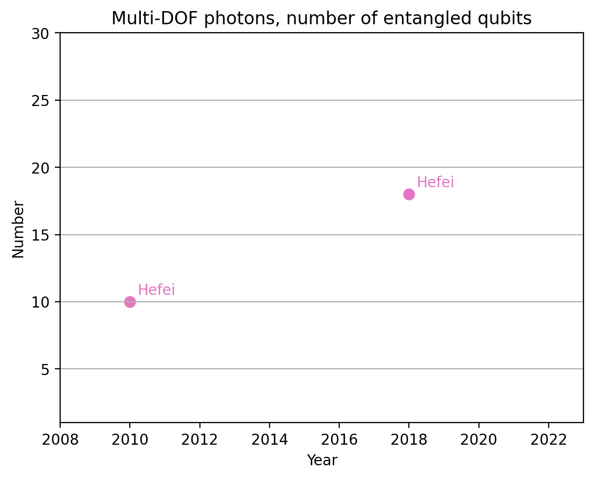

# Number of genuinely entangled qubits
Originally adapted from [Mario Krenn](https://mariokrenn.wordpress.com/2021/01/29/reference-list-for-records-in-large-entanglement-generation-number-of-qubits-in-ghz-states/), with permission.
## Cross-platform comparisons
The largest measured GHZ states accross different platforms. 

[Question mark](#Why-does-a-datapoint-have-a-question-mark?)

## Individual platforms

All platforms individually, annotated with the place where the result was obtained, and the data source table (copied from CSV files in the repo)

### Trapped ions

| Year | Number | Place     | Citation      | 
|------|--------|-----------|---------------| 
| 2000 | 4      | NIST      | Sackett2000a  | 
| 2005 | 6      | NIST      | Leibfried2005 | 
| 2011 | 14     | Innsbruck | Monz2011      | 
| 2021 | 25     | Innsbruck | Pogorelov2021 | 

### Superconducintg qubits

| Year | Number | Place         | Citation     | 
|------|--------|---------------|--------------| 
| 2010 | 3      | Yale          | Dicarlo2010  | 
| 2014 | 5      | UCSB          | Barends2014a | 
| 2017 | 10     | Hangzhou      | Song2017     | 
| 2019 | 18     | Hangzhou      | Song2019     | 
| 2021 | 27     | Melbourne/IBM | Mooney2021   | 

### Neutral atoms

| Year | Number | Place | Citation           | 
|------|--------|-------|--------------------| 
| 2000 | 3      | Paris | Rauschenbeutel2000 | 
| 2019 | 20     | MIT   | Omran2019          | 

### Photons

| Year | Number | Place     | Citation        | 
|------|--------|-----------|-----------------| 
| 1999 | 3      | Innsbruck | Bouwmeester1999 | 
| 2001 | 4      | Vienna    | Pan2001         | 
| 2004 | 5      | Hefei     | Zhao2004        | 
| 2007 | 6      | Hefei     | Lu2007          | 
| 2011 | 8      | Hefei     | Huang2011       | 
| 2016 | 10     | Hefei     | Wang2016a       | 
| 2018 | 12     | Hefei     | Zhong2018       | 

### Photons, using multiple degrees of freedom

| Year | Number | Place | Citation | 
|------|--------|-------|----------| 
| 2010 | 10     | Hefei | Gao2010  | 
| 2018 | 18     | Hefei | Wang2018 | 

## FAQ
### Why does a datapoint have a question mark?
The preprint in question, Moore2021, claims to have measured the largest GHZ state observed to date. The claim relies on a new method of measurement result post-processing (referred to as QREM in the paper). Therefore, it is reasonable for this technique to be verified before the record is "confirmed". I hope to add the point once the paper passes peer-review. The other best result, Pogorelov2021, is also a preprint, but uses a well-established and simple read-out technique. Therefore, it is included without the question mark.

### Which data points are shown in these plots?

The plots show the largest numbers of genuinely entangled qubits across different platforms.

### When is entanglement genuine?

This is a [notation](https://en.wikipedia.org/wiki/Multipartite_entanglement). Experimentally, it requires the fidelity with respect to the target maximally entangled state to exceed 50%.

### Does the Year refer to the date of publication, or the year of the preprint?
For simplicity, it's the year of publication if the paper is already published. 

### What if multiple best results come out in the same year?
The plot only shows the best result from a given year, regardless of the month of publishing.

## Technical support
- The plots shown below are generated by the [plotting.py](plotting.py) file. Feel free to take it and adapt to your own purposes.
- Raw data files are stored in CSV format in the data folder, divided by platform. The tables below are copy-pasted by hand.
- Citation keys in the tables correspond to bibtex entries. The bibtex files are also available in the data folder.
- All the plots are available in the plots folder in PNG

